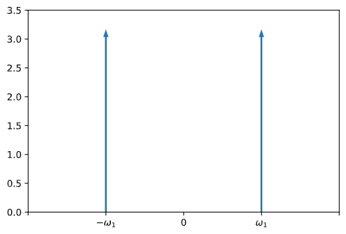
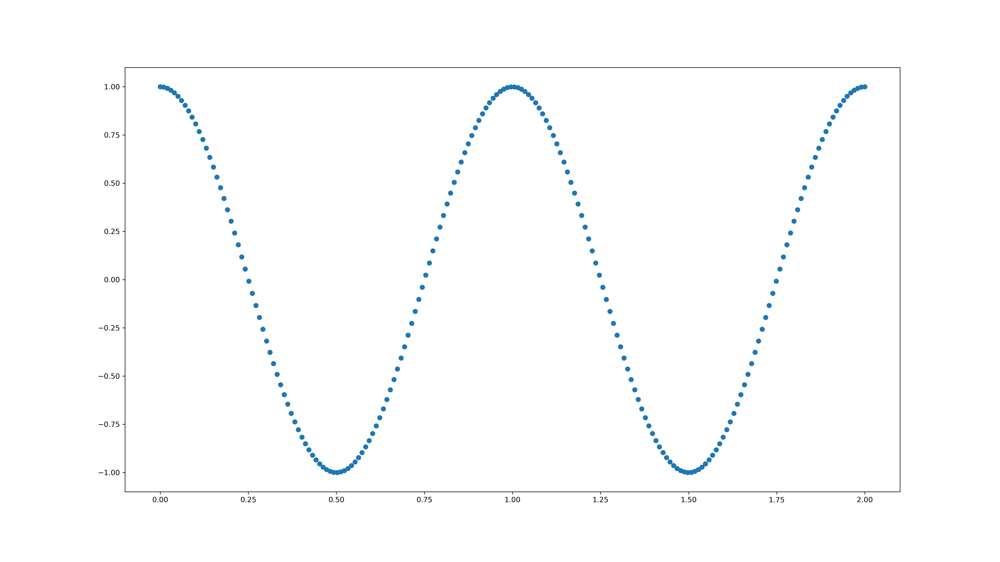
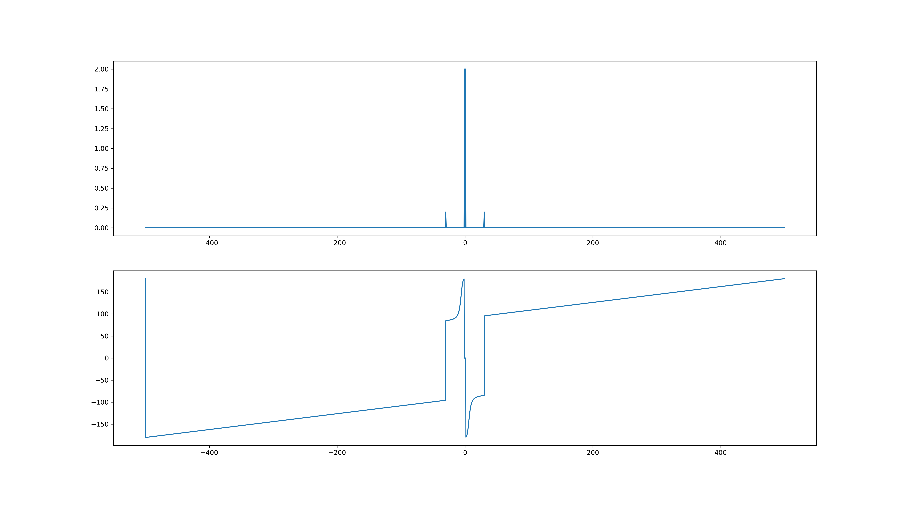
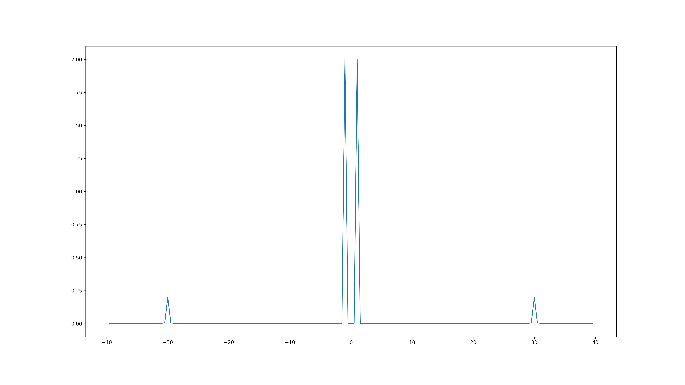
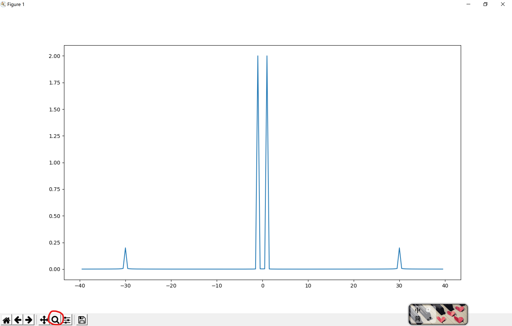

<!-- toc -->
# FFT入门
## 预备知识

1. 信号 $s=A\cos(\omega t + \phi)$，其中$A$为信号的幅值，$\phi$为信号的相位。傅里叶变换就是要找到  $\omega$ ~$A$， 以及$\omega$ ~$\phi$  的关系。（一般我们处理数据大多使用$\omega$ ~$A$的关系）。
2. 所有的信号都可以由若干个不同幅值、相位、频率的余弦信号叠加而成即$s=A_1\cos(\omega_1+\phi_1)+A_2\cos(\omega_2+\phi_2)+A_3\cos(\omega_3+\phi_3)+...$   如下图多个频率的余弦逼近门函数


3. 傅里叶变换公式：
   $$ \mathscr{F}(\omega)=\mathscr{F}[f(t)]=\int_{-\infty}^{+\infty}f(t)e^{-j\omega t} \mathcal{d}t$$ 
   傅里叶逆变换
   $$\mathscr{f}(\omega)=\mathscr{F}^{-1}[f(\omega)]=\frac{1}{2\pi}\int_{-\infty}^{+\infty}\mathscr{F}(\omega)e^{j\omega t} \mathcal{d}\omega$$
   注：$\mathscr{F}[f(t)]$称之为对 $f(t)$的傅里叶变换

4. 这里需要简单介绍一下单位冲击函数$\delta(t)$，在图形上用一个长度为1的箭头表示如下图所示
单位冲击函数具有如下性质
$$\int_{-\infty}^{+\infty} \delta(t)dt=\int_{0^+}^{0^-}\delta(t)dt=1
$$

5. cos的傅里叶变换为两个幅值为$\pi$冲击函数 $\delta(\omega)$
   $$\mathscr{F}[\cos(\omega_1t)]=\pi[\delta(\omega-\omega_1)+\delta(\omega+\omega_1)]
   $$
   称$\cos(\omega_1 t) \Leftrightarrow\pi[\delta(\omega-\omega_1)+\delta(\omega+\omega_1)]$为傅里叶变换对。
   
在图形上是两个幅值为$\pi$频率$\omega=\pm\omega_1$的冲激函数 所以在乘上$\frac{1}{\pi}$后可以得到原来信号的幅值，由此我们找到了$\omega$ ~$A$的关系
 
6. 实际处理的数据不同于上面的连续信号，这里要引入一个采样率$Fs$即一秒钟对信号进行多少次采样。例如对于$\cos(\omega_1 t)$ 来说，以采样率$Fs=1000$得到的信号就是一个这样的序列：[$\cos(0.001\omega_1),\cos(0.002\omega_1),\cos(0.003\omega_1),...$]。
7. 由于实际处理的信号都是一个个离散的数值，我们对这些信号的处理称之为离散傅里叶变换DTF，在利用傅里叶变换的对称性优化后得到快速傅里叶变换即我们常用的FFT。(记住我们处理的是离散的数值序列就行。)

## 代码实操
这里用到的两个库: 
- `numpy` 包含常用的数学函数，我们要用的就是与fft相关的函数。
- `matplotlib` 常用的画图库，语法与`MATLAB`类似。


```python
import numpy as np
import matplotlib.pyplot as plt

Fs = 100 #每秒采样率
 
t = np.linspace(0,2,2*Fs) #2秒钟，每秒100个点 这句话是把[0,2]分成200个等间距序列
signal = np.cos(2*np.pi*1*t) 
plt.scatter(t,signal)#plt.plot(t,signal) 画曲线用plot 画离散点用scatter
plt.show()
```
当我们将t和signal的作为坐标值得出下图

为了便于观看通常我们使用`plt.plot()`将相邻的点连接起来便会看到较为光滑的曲线。 

采样率$Fs$越大，采集的点就会越密集。这里补充一个知识点：叫做奈奎斯特采样定理。简单的说就是我们可以采集到的频率范围是$[-\frac{Fs}{2},\frac{Fs}{2}]$

```python
import numpy as np
import matplotlib.pyplot as plt

Fs = 1000 #每秒采样率
 
t = np.linspace(0,2,2*Fs) #2秒钟，每秒1000个点
signal =2 * np.cos(2*np.pi*1*t) + 0.2*np.sin(2*np.pi*30*t)
plt.plot(t, signal)
plt.show()
```
这段程序中先确定了变量$t = [0,0.001,0.002,...,1.999,2]$
这里我们生成一个幅值为 2  频率为 1Hz 的余弦与一个幅值为  0.2  频率为  30Hz  的正弦相加$Signal = 2\cos(2\pi t)+0.2\sin(2\pi\times30t)$根据t的不同取值得到得到一个与之对应的信号序列。使用`plt.plot(t, signal)`画图后可以得到下图。


接下来我们对这个信号进行傅里叶变换，具体实现如下。其中`np.fft.fftfreq(n, d=1/Fs)`是把计算的值换算到常用的以Hz为单位的坐标轴，范围就是之前提到的$[-\frac{Fs}{2},\frac{Fs}{2}]$。傅里叶变换得到的频率信号是[0, 0.1, ... , 499.9, 500,-500,-499.9, ..., -0.1]。`np.fft.fftshift(freq)`的作用是把频率从小到大重新排列。`F_disp`也是同理。
```python
F = np.fft.fft(signal)
n = signal.size
freq =  np.fft.fftshift( np.fft.fftfreq(n, d=1/Fs))
F_disp =  np.fft.fftshift(F)
plt.subplot(211), plt.plot(freq, (2*np.abs( F_disp )/n)) 
plt.subplot(212), plt.plot(freq, (np.angle( F_disp )/np.pi*180))
plt.show()
```
在二维平面上我们使用幅值和相位来描述这个信号。(`np.abs(a)`，若a是复数，返回a的模，否则就是a的绝对值。)通过`plt`画图得到下图，代表了幅值和相位随频率的变化。`(2*np.abs( F_disp )/n)`对应的就是预备知识中的第五点，连续函数乘上$\frac{1}{\pi}$， 离散序列乘上$\frac{1}{\frac{n}{2}}$也就是$\frac{2}{n}$。($2\pi$对应$n$， $\pi$对应$\frac{n}{2}$)

对幅值和相位不是很敏感的同学可以绘制3D图来理解FFT的结果，这里我们设置x轴为频率，y轴为实部，z轴为虚部。

绘制3D图的程序如下
```python
ax = plt.axes(projection='3d')
ax.set_zlim(-2,2)
ax.set_ylim(-2,2)
ax.set_xlim(-50,50)
ax.plot3D(freq  ,2*F_disp.imag/n, 2*F_disp.real/n)
plt.show()
```
由于我们的采样率$Fs = 1000$,这就意味着我们的的频率范围是$[-500,500]$。为了方便观察，我们将只选取频率在[-40, 40]的范围进行观察。

```python
freq_band = np.logical_and(freq>-40, freq<40)
plt.plot(freq[freq_band], (2*np.abs( F_disp[freq_band])/n)) 
```

虽然点击对话框上的放大镜可以实现放大观察，但是`freq_band = np.logical_and(freq>-40, freq<40)`将[-40,40]之间的频率信号保留下来，为我们接下来的滤波打下基础。

现实处理的信号也与我们之前处理的$Singal$类似，我们希望得到的信号通常是频率较低幅值较大，对应$2\cos(2\pi t)$，夹杂的噪声通常是频率较高幅值较小,对应$0.2\sin(2\pi\times30t)$
接下来我们将30Hz的正弦波滤去还原一个平滑的余弦波。
 - `np.logical_or(freq<-5, freq>5)`选取频率小于-5和大于5的区域，
 - `F_disp[freq_band_filter] = 0`将这些区域的数值置零
 - 绘制频谱发现30Hz处的尖峰已经滤除
  
 - 由于我们刚刚处理的是平移过的频谱，因此在傅里叶逆变换还原信号前需要使用`np.fft.fftshift(F_disp)`进行频谱平移，再使用`np.fft.ifft()`还原信号
  
- 滤除高频噪声后就能得到我们想要的低频信号。
```python
freq_band_filter = np.logical_or(freq<-5, freq>5)
F_disp[freq_band_filter] = 0
plt.plot(freq[freq_band], (2*np.abs( F_disp[freq_band])/n)) 
filter_sig = np.fft.ifft(np.fft.fftshift(F_disp))
plt.plot(t,filter_sig)
plt.show()
```