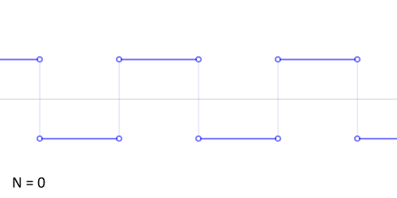

# FFT入门
## 预备知识

1. 信号 $s=A\cos(\omega t + \phi)$，其中$A$为信号的幅值，$\phi$为信号的相位。傅里叶变换就是要找到  $\omega$ ~$A$， 以及$\omega$ ~$\phi$  的关系。（一般我们处理数据大多使用$\omega$ ~$A$的关系）。
2. 所有的信号都可以由若干个不同幅值、相位、频率的余弦信号叠加而成即$s=A_1\cos(\omega_1+\phi_1)+A_2\cos(\omega_2+\phi_2)+A_3\cos(\omega_3+\phi_3)+...$   如下图多个频率的余弦逼近门函数

3. 傅里叶变换公式：
   $$ \mathscr{F}(\omega)=\mathscr{F}[f(t)]=\int_{-\infty}^{+\infty}f(t)e^{-j\omega t} \mathcal{d}t$$ 
   傅里叶逆变换
   $$\mathscr{f}(\omega)=\mathscr{F}^{-1}[f(\omega)]=\frac{1}{2\pi}\int_{-\infty}^{+\infty}\mathscr{F}(\omega)e^{j\omega t} \mathcal{d}\omega$$
   注：$\mathscr{F}[f(t)]$称之为对 $f(t)$的傅里叶变换

4. 这里需要简单介绍一下单位冲击函数$\delta(t)$，在图形上用一个长度为1的箭头表示如下图所示
单位冲击函数具有如下性质
$$\int_{-\infty}^{+\infty} \delta(t)dt=\int_{0^+}^{0^-}\delta(t)dt=1
$$

5. cos的傅里叶变换为两个幅值为$\pi$冲击函数 $\delta(\omega)$
   $$\mathscr{F}[\cos(\omega_1t)]=\pi[\delta(\omega-\omega_1)+\delta(\omega+\omega_1)]
   $$
   称$\cos(\omega_1 t) \Leftrightarrow\pi[\delta(\omega-\omega_1)+\delta(\omega+\omega_1)]$为傅里叶变换对。
   
在图形上是两个幅值为$\pi$频率$\omega=\pm\omega_1$的冲激函数 所以在乘上$\frac{1}{\pi}$后可以得到原来信号的幅值，由此我们找到了$\omega$ ~$A$的关系
 
6. 实际处理的数据不同于上面的连续信号，这里要引入一个采样率$Fs$即一秒钟对信号进行多少次采样。例如对于$\cos(\omega_1 t)$ 来说，以采样率$Fs=1000$得到的信号就是一个这样的序列：[$\cos(0.001\omega_1),\cos(0.002\omega_1),\cos(0.003\omega_1),...$]。
7. 由于实际处理的信号都是一个个离散的数值，我们对这些信号的处理称之为离散傅里叶变换DTF，在利用傅里叶变换的对称性优化后得到快速傅里叶变换即我们常用的FFT。
